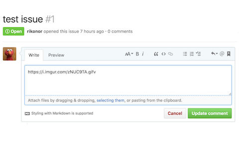
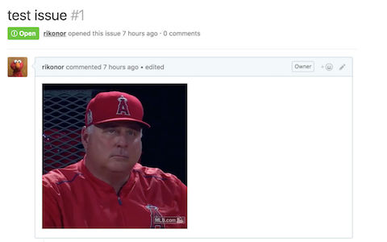

### Github GIFV Support

[Download](https://chrome.google.com/webstore/detail/github-gifv-s
upport/mldcdglpicmchhkmipmhlempbneobgmp) from the Chrome Store.

#### Usage

Once installed, simply putting a gifv link in a github comment will render the actual gifv for anyone with the extension.

#### Screenshots

#### License

MIT
